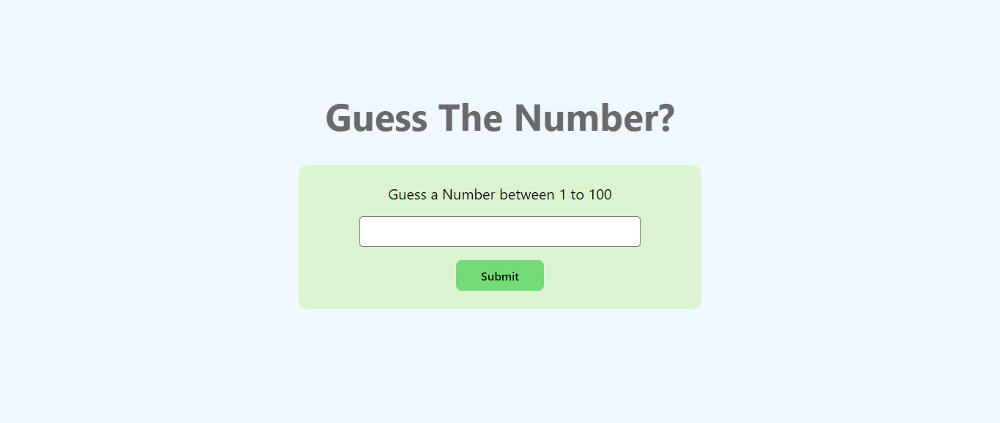
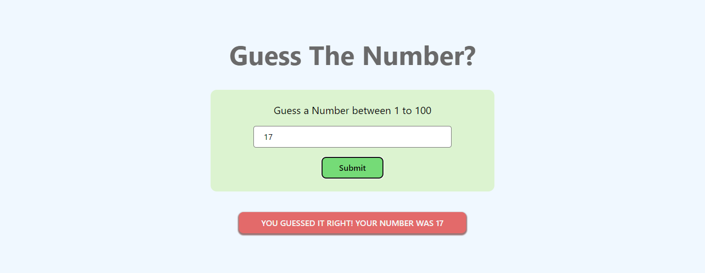

# Guess The Number Game with React

This project is a simple and interactive "Guess the Number" game built using React and React Hook Form. The main objective of the game is for the player to guess a randomly generated number between 1 and 100. The application provides instant feedback on each guess, letting the player know if their guess is too high, too low, or correct.

Technologies Used:

- **React**: Used to build the interactive user interface with component-based architecture.
- **React Hook Form**: For managing form state and validation with ease.
- **CSS**: Basic styling for a clean and user-friendly interface.